# Лабораторная работа №5. Облачные базы данных. Amazon RDS

## Цель работы
Целью работы является ознакомиться с сервисами Amazon RDS (Relational Database Service) и Amazon DynamoDB, а также научиться:

  - Создавать и настраивать экземпляры реляционных баз данных в облаке AWS с использованием Amazon RDS.
  - Понимать концепцию Read Replicas и применять их для повышения производительности и отказоустойчивости баз данных.
  - Подключаться к базе данных Amazon RDS с виртуальной машины EC2 и выполнять базовые операции с данными (создание, чтение, обновление, удаление записей - CRUD).


## Шаг 1. Подготовка среды (VPC / подсети / группы безопасности)

1. **Создание VPC**

   * Заходим в **AWS Console → VPC → Create VPC → VPC and more**.
   * Имя VPC: `project-vpc`.
   * Создаём:

     * 2 публичные подсети в разных AZ.
     * 2 приватные подсети в разных AZ.

   > Публичные подсети будут использоваться для EC2, приватные — для RDS.

   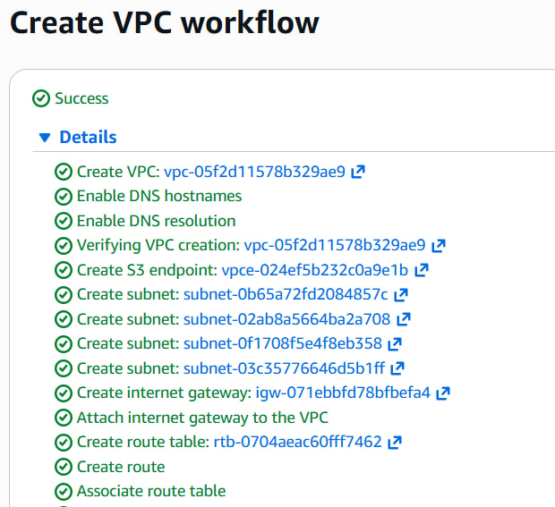


2. **Создание группы безопасности для приложения (web-security-group)**
   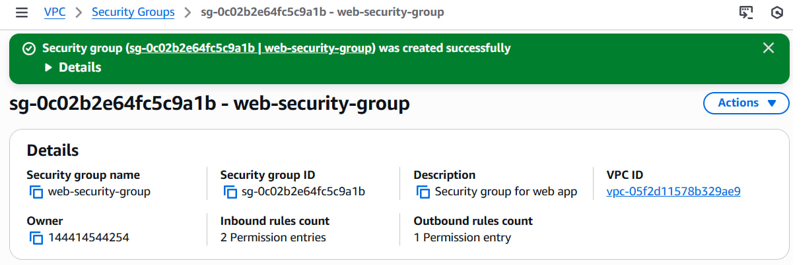

   * Разрешаем входящий трафик:

     * **HTTP (порт 80)**: источник — любой (`0.0.0.0/0`).
     * **SSH (порт 22)**: источник — ваш IP (для учебных целей можно открыть для любого источника).
   * Разрешаем исходящий трафик для подключения к базе данных:

     * **MySQL (порт 3306)**: цель — `db-mysql-security-group`.

3. **Создание группы безопасности для базы данных (db-mysql-security-group)**
   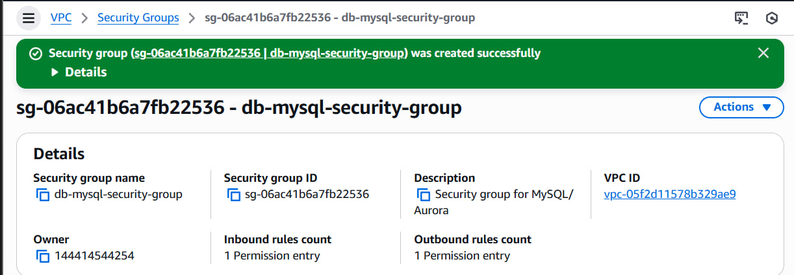

   * Разрешаем входящий трафик:

     * **MySQL (порт 3306)**: источник — `web-security-group` (только ваше приложение сможет подключаться).

---

## Шаг 2. Развёртывание Amazon RDS

1. **Создание Subnet Group**

   * Переходим в **RDS → Subnet Groups → Create DB Subnet Group**.
   * Имя: `project-rds-subnet-group`.
   * Выбираем VPC: `project-vpc`.
   * Добавляем 2 приватные подсети из разных AZ.
   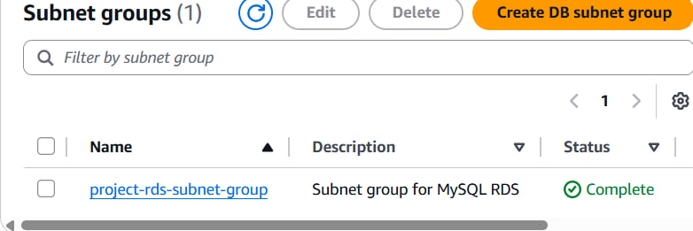

   ### ❓ Контрольные вопросы
   Subnet Group — это список приватных подсетей в выбранной VPC, куда RDS будет размещать сетевые интерфейсы базы. Я добавила две приватные подсети в разных AZ, чтобы база была изолирована от интернета и при необходимости могла работать в разных зонах. Без Subnet Group RDS не знает, в каких подсетях внутри VPC разворачивать экземпляр БД.

2. **Создание базы данных RDS**
   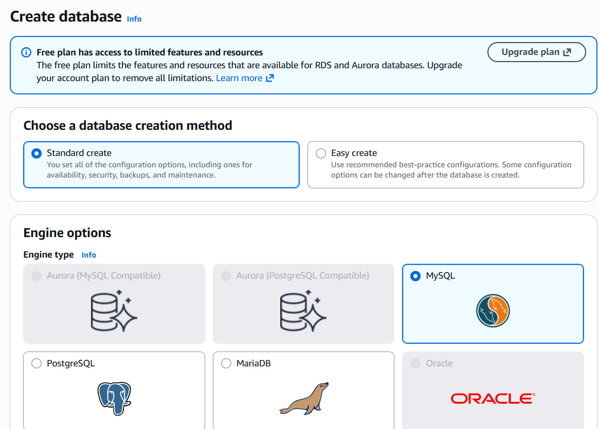
   * **RDS → Databases → Create Database → Standard Create**.
   * Настройки базы данных:
    
   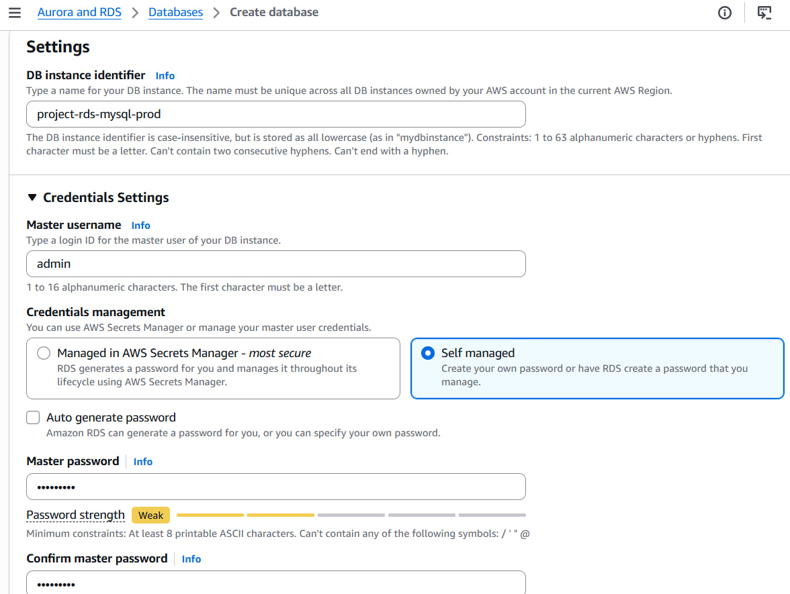
     * Engine: MySQL
     * Version: MySQL 8.0.42 (или последняя)
     * Template: Free tier
     * Deployment: Single-AZ
     * DB instance identifier: `project-rds-mysql-prod`
     * Master username: `admin`
     * Master password: (указать и подтвердить)
     * DB instance class: `db.t3.micro`
     * Storage: General Purpose SSD (gp3), 20 GB, autoscaling включен, max 100 GB

3. **Подключение и безопасность**

   * VPC: `project-vpc`
   * DB Subnet Group: `project-rds-subnet-group`
   * Public access: No
   * Security group: `db-mysql-security-group`
   * Initial database name: `project_db`
   * Backup: включить автоматический бэкап, отключить шифрование
   * Maintenance: выключить auto minor version upgrade

4. **Создание базы данных**
   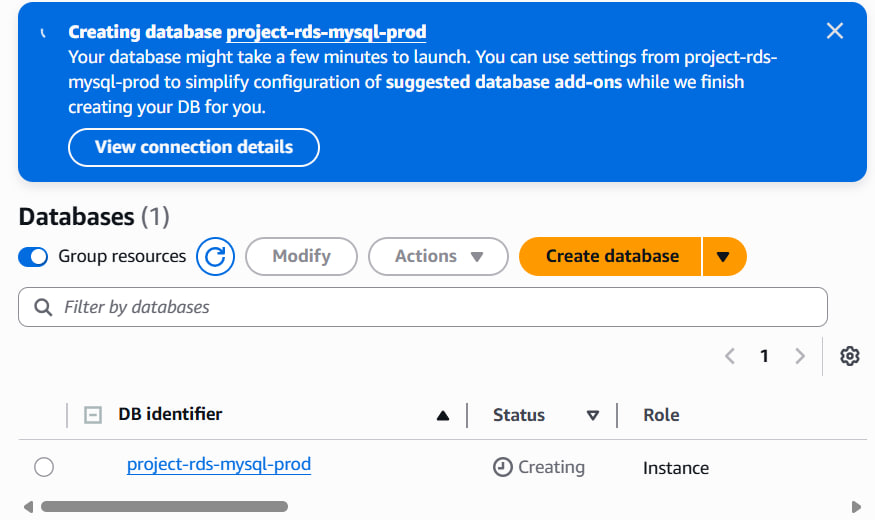

   * Нажать **Create database** и дождаться статуса `Available`.
   * Скопировать **Endpoint** базы данных (будет использоваться для подключения).

   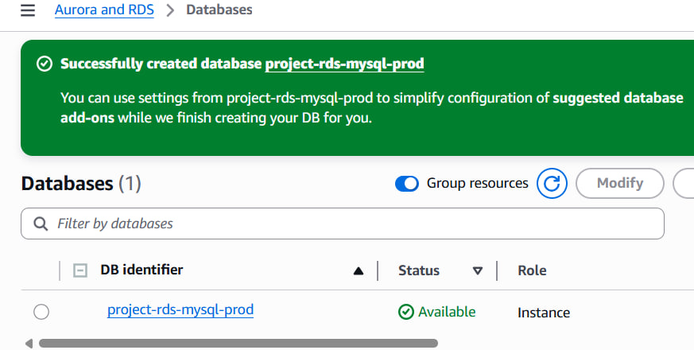

---

## Шаг 3. Создание виртуальной машины EC2

1. **Создание EC2 в публичной подсети**

   * **EC2 → Launch Instance → Select Amazon Linux 2023 / Amazon Linux 2**
   * Подсеть: публичная из `project-vpc`
   * Security group: `web-security-group`

   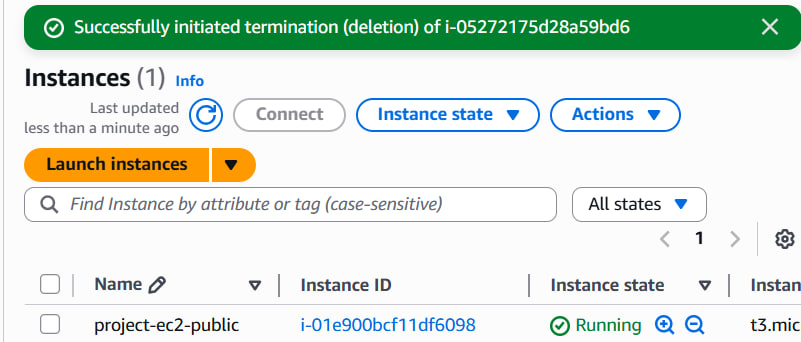

2. **Установка MySQL клиента**

   * Подключаемся по SSH к EC2.
   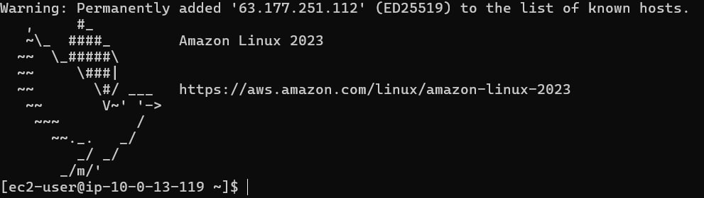
   * Выполняем команды:

   ```bash
   sudo dnf update -y
   sudo dnf install -y mariadb105
   ```

   > MariaDB клиент подходит для подключения к MySQL.
   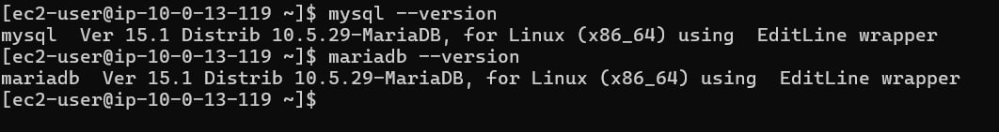

---

## Шаг 4. Подключение к базе данных и базовые операции

1. **Подключение к RDS**

   ```bash
   mysql -h <RDS_ENDPOINT> -u admin -p
   ```
   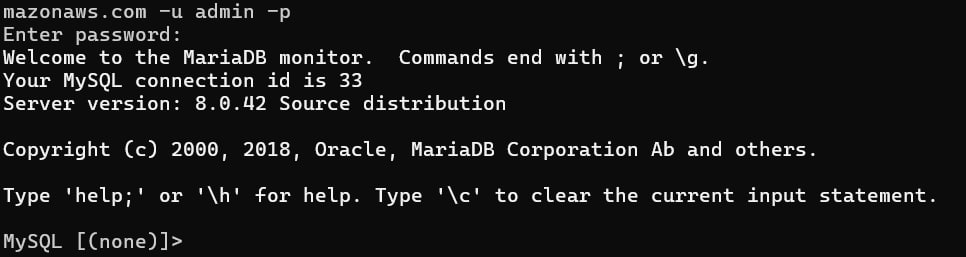

   * Ввести пароль администратора.
   * Выбрать базу данных:
   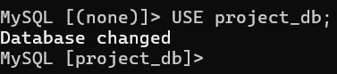


2. **Создание таблиц с связью 1 ко многим**

   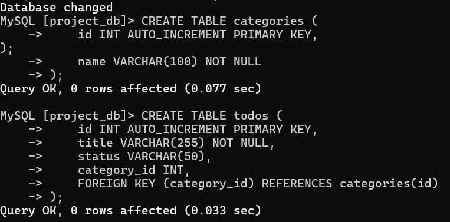

3. **Вставка данных**

   ```sql
   INSERT INTO todos (title, status, category_id) VALUES
   ('Fix laba5 bug', 'in_progress', 1),
   ('Buy groceries ', 'done', 2),
   ('Prepare exam', 'not_started', 3);
   ```
   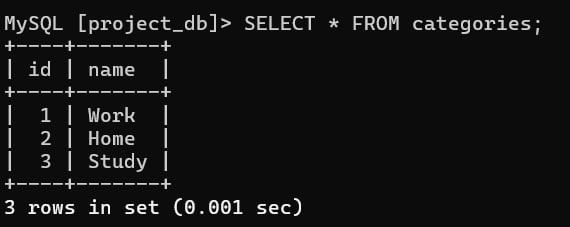

   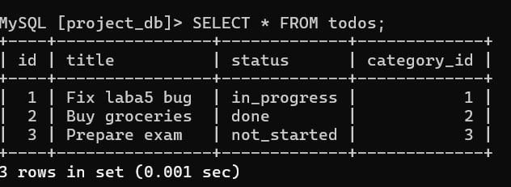


4. **Выборка данных с JOIN**

   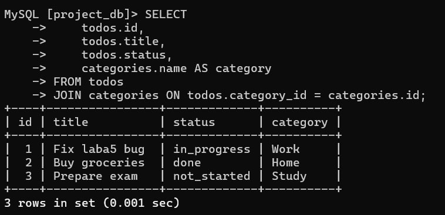

   

---

## Шаг 5. Создание Read Replica

1. **Создание реплики**

   * RDS → выбрать базу → **Actions → Create read replica**
   * Параметры:

     * DB instance identifier: `project-rds-mysql-read-replica`
     * Instance class: `db.t3.micro`
     * Storage: gp3
     * Monitoring: отключено
     * Public access: No
     * Security group: `db-mysql-security-group`
   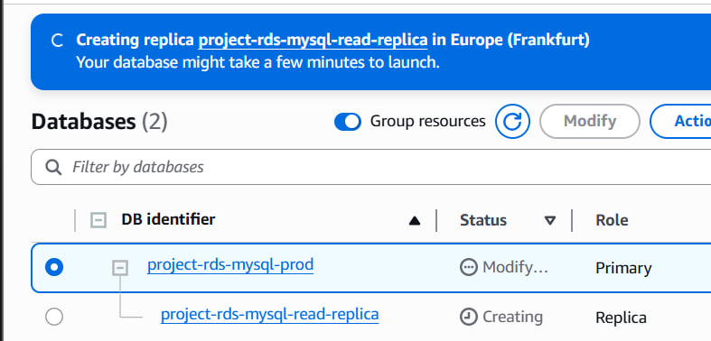

2. **Подключение к Read Replica**
   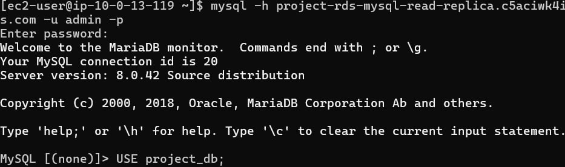

   ```bash
   mysql -h <REPLICA_ENDPOINT> -u admin -p
   ```
   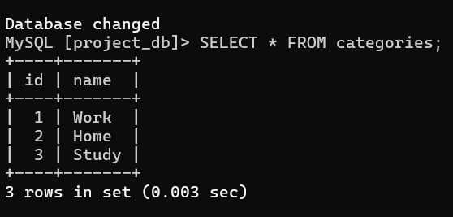
   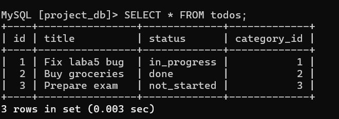

   * Выполняем SELECT-запросы на чтение.
   * Попытка INSERT/UPDATE выдаст ошибку (только чтение).

   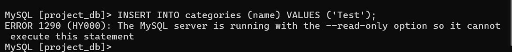

   ### ❓ Контрольные вопросы
   - Какие данные вижу на реплике и почему: те же данные, что уже записаны на мастере и успели реплицироваться. Реплика получает изменения асинхронно, поэтому может быть небольшая задержка (репликация не мгновенная).
   - Попытка INSERT/UPDATE на реплике: не получается, сервер возвращает ошибку, потому что экземпляр реплики работает в режиме read-only (на нем нельзя менять данные).
   - Добавила запись на основном экземпляре — появилась ли на реплике: да, появляется через короткое время после репликации, так как изменения передаются с master на read replica.
   - Зачем нужны Read Replicas: разгружать операции чтения, ускорять SELECT-запросы, масштабировать чтение без нагрузки на master, выносить аналитические/отчетные запросы, обслуживать географически распределенных пользователей. Это не замена Multi-AZ (HA), но помогает масштабировать чтение.


3. **Проверка репликации**

   * Добавляем новую запись на основном экземпляре:

   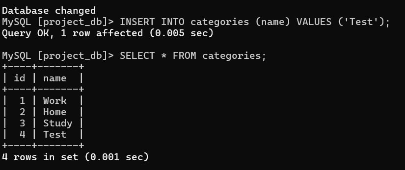

   * Выполняем SELECT на реплике — данные появились.

4. **Назначение Read Replica**

   * Используется для распределения нагрузки на чтение, ускорения выборок, масштабирования базы без увеличения нагрузки на основной экземпляр.

---


## Шаг 6. Подключение приложения к базе данных Выберите один из вариантов ниже для подключения приложения к базе данных Amazon RDS и выполнения базовых операций с данными (CRUD).

### Шаг 6b. Развертывание CRUD приложения

1. Подключается к базе данных Amazon RDS.
2. Выполняет базовые операции с данными: **создание**, **чтение**, **обновление**, **удаление** (CRUD).
3. Использует **основной экземпляр (master)** для записи и **read replica** для чтения, чтобы продемонстрировать распределение нагрузки.

#### Запуск:
Проверка приложения через браузер
Перейди по адресу:
```
http://<EC2_PUBLIC_IP>/index.php
```

Должен отобразиться список задач (чтение через read replica).


### **Что мы сделали пошагово**

#### **1. Настройка среды на EC2**

* На виртуальной машине EC2 установили веб-сервер Apache и PHP:

```bash
sudo dnf install -y httpd php php-mysqlnd php-pdo
sudo systemctl enable httpd
sudo systemctl start httpd
```

* Веб-папка: `/var/www/html/` - туда мы поместили наш PHP-код.

> Это позволило запускать веб-приложение прямо с EC2 и обращаться к нему через браузер.


#### **2. Подключение к базе данных RDS**

* Создали два подключения через PHP:

1. **Master (основной экземпляр)** — для операций **создания, обновления и удаления** записей.
2. **Read Replica** — для операций **чтения** данных.

```php
$master = new PDO("mysql:host=$master_host;dbname=$db_name", $db_user, $db_pass);
$replica = new PDO("mysql:host=$replica_host;dbname=$db_name", $db_user, $db_pass);
```

* Это демонстрирует **разделение нагрузки**: записи на master, чтение на реплике.


#### **3. Реализация CRUD функционала**

**a) Чтение задач** (через read replica)

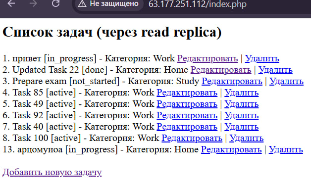

* Запрос с `ORDER BY` для упорядочивания задач по `id`:

```php
SELECT todos.id, todos.title, todos.status, categories.name AS category_name
FROM todos
JOIN categories ON todos.category_id = categories.id
ORDER BY todos.id ASC
```

* Все задачи отображаются на веб-странице.


**b) Создание задачи** (через master)

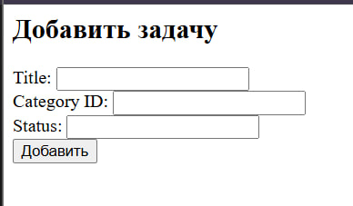

* Создана форма, где пользователь вводит `title`, `category_id` и `status`.
* После отправки формы данные записываются в **master** с помощью подготовленного запроса:

```php
INSERT INTO todos (title, category_id, status) VALUES (?, ?, ?)
```


**c) Обновление задачи** (через master)

* При нажатии на “Редактировать” открывается форма с текущими данными задачи.
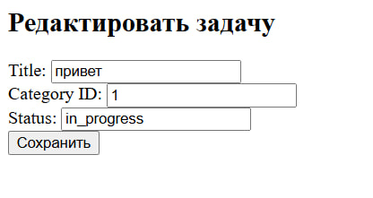

* После изменения полей `title`, `category_id`, `status` данные обновляются в **master**:

```php
UPDATE todos SET title=?, category_id=?, status=? WHERE id=?
```


**d) Удаление задачи** (через master)

* Рядом с каждой задачей есть ссылка "Удалить", которая удаляет запись из **master**:

```php
DELETE FROM todos WHERE id=?
```


